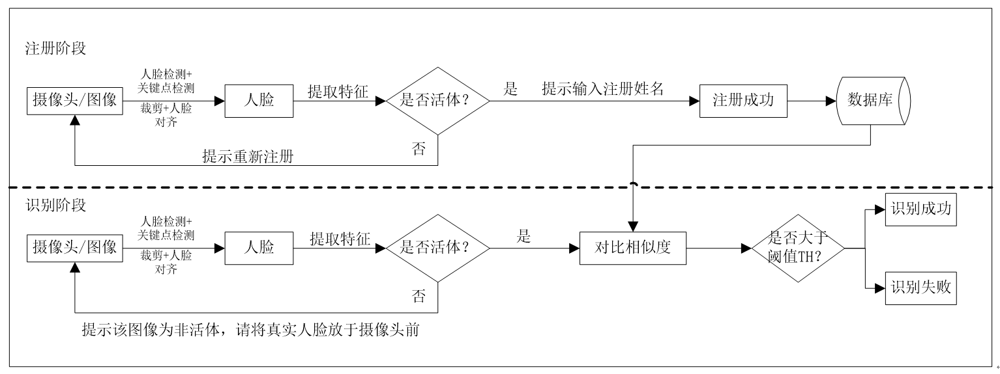

# FaceRecognition
该项目利用c++实现了一个人脸识别的pipline demo，带有反伪装人脸攻击的功能。

## requirement
opencv3.3及以上，带有人脸识别contrib module

dlib

vs2013

## repository description

程序分注册和识别两部分，带有人脸的图片首先利用opencv自带检测器检测人脸，然后利用dlib标出关键点，利用关键点信息做人脸归一化处理。

注册阶段分更新分类器或不更新分类器两种模式。（更新分类器：在之前注册的基础上更新模型；不更新：清空之前的注册信息，重新开始注册）
注册所用分类器（人脸识别所用到的识别器）是opencv自带的LBP人脸识别模型。

识别阶段，在获得归一化的人脸信息后，调用人脸识别分类器一一比对特征相似度，取最大相似度的那一张图片的ID为识别结果。

人脸反伪装模型，通过提取归一化后人脸的elbp特征，然后训练svm分类器得到。

整个人脸识别的pipline如下图所示：

